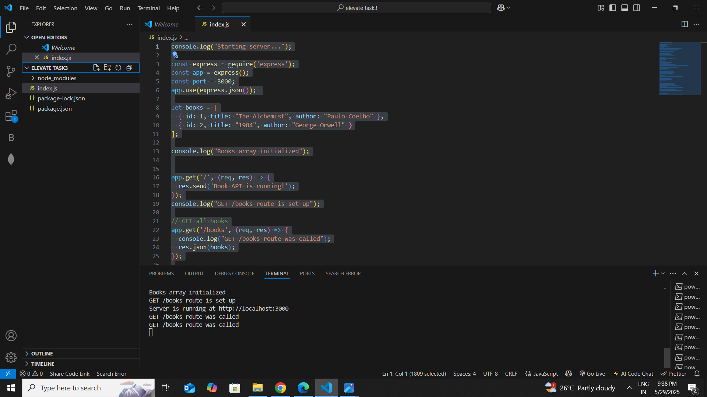
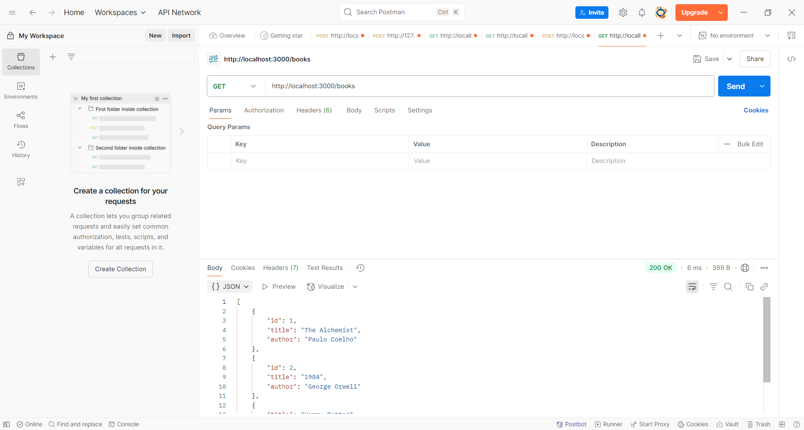
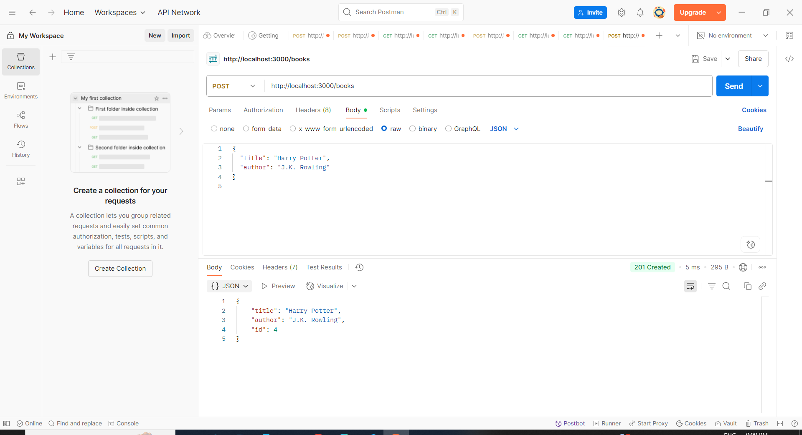
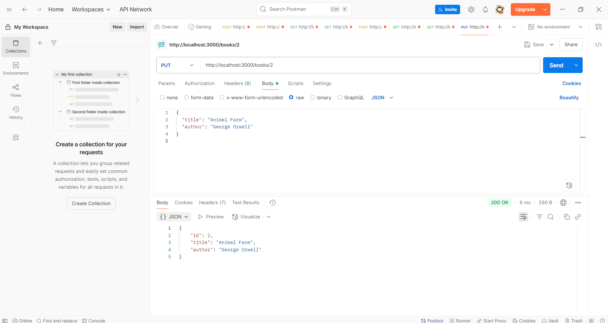
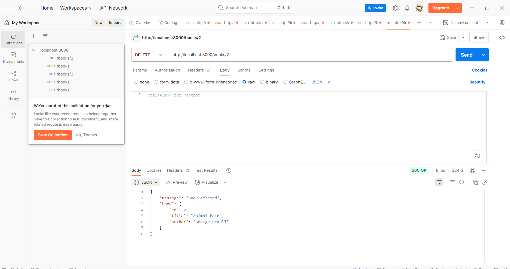

# Book API

A simple RESTful API built with Node.js and Express to manage a collection of books.

## Features

- Get all books (`GET /books`)
- Add a new book (`POST /books`)
- Update a book by ID (`PUT /books/:id`)
- Delete a book by ID (`DELETE /books/:id`)

## Setup and Installation

1. Clone the repository:

   ```bash
   git clone <repository-url>
## Screenshots

### Server Running


### GET /books Response


### POST /books Request and Response


### PUT /books/:id Request and Response


### DELETE /books/:id Request and Response

